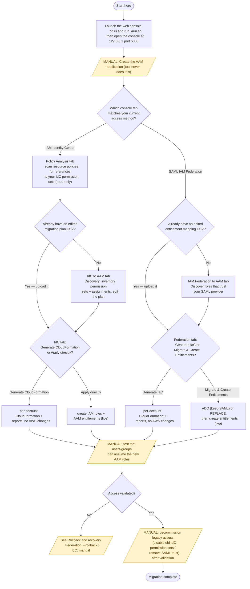

# AAM Migration Tool

Migrate to **[AWS Account Access Manager (AAM)](https://docs.aws.amazon.com/IAM/latest/UserGuide/account-access-manager.html)** from [IAM Identity Center (IdC)](https://docs.aws.amazon.com/singlesignon/latest/userguide/what-is.html) or [SAML-based IAM Federation](https://docs.aws.amazon.com/IAM/latest/UserGuide/id_roles_providers_saml.html). This tool automates discovery, policy analysis, role creation, and entitlement mapping through a browser-based console running on your local machine.

### Reference documentation

These are the canonical AWS docs for the services and concepts this tool works with. They are linked again on first mention throughout this README.

| Topic | AWS documentation |
|-------|-------------------|
| Account Access Manager (AAM) — overview | [What is account access manager?](https://docs.aws.amazon.com/IAM/latest/UserGuide/account-access-manager.html) |
| AAM — getting started (create/enable the application) | [Getting started with account access manager](https://docs.aws.amazon.com/IAM/latest/UserGuide/account-access-manager-getting-started.html) |
| AAM — create the application (API) | [`CreateApplication`](https://docs.aws.amazon.com/account-access/latest/APIReference/API_CreateApplication.html) · [CLI `create-application`](https://docs.aws.amazon.com/cli/latest/reference/account-access/create-application.html) |
| AAM — entitlements (API) | [`CreateEntitlement`](https://docs.aws.amazon.com/account-access/latest/APIReference/API_CreateEntitlement.html) · [all operations](https://docs.aws.amazon.com/account-access/latest/APIReference/API_Operations.html) |
| AAM — security & IAM permissions | [Security in account access manager](https://docs.aws.amazon.com/IAM/latest/UserGuide/aam-security.html) · [`account-access` actions & condition keys](https://docs.aws.amazon.com/service-authorization/latest/reference/list_account-access.html) |
| IAM Identity Center (IdC) | [What is IAM Identity Center?](https://docs.aws.amazon.com/singlesignon/latest/userguide/what-is.html) |
| SAML-based IAM federation | [SAML 2.0 federation](https://docs.aws.amazon.com/IAM/latest/UserGuide/id_roles_providers_saml.html) |
| IAM role trust policies | [Create a role using custom trust policies](https://docs.aws.amazon.com/IAM/latest/UserGuide/id_roles_create_for-custom.html) · [Update a role trust policy](https://docs.aws.amazon.com/IAM/latest/UserGuide/id_roles_update-role-trust-policy.html) |
| Customer managed policies (CMPs) | [Managed policies and inline policies](https://docs.aws.amazon.com/IAM/latest/UserGuide/access_policies_managed-vs-inline.html) |

---

## Getting Started

The recommended way to use this tool is through the **web console**:

```bash
cd ui
./run.sh
```

Open **http://127.0.0.1:5000** in your browser. The script handles everything: Python venv, dependencies, frontend build, and Flask server.

**Requirements:** Python 3.11+, Node.js 18+, AWS credentials configured locally, and a configured AAM Application (see [documentation for creating an AAM application](https://docs.aws.amazon.com/IAM/latest/UserGuide/account-access-manager-getting-started.html)).

See [`ui/README.md`](ui/README.md) for full UI documentation including credential requirements, operating modes, and troubleshooting.

---

## Recommended workflow

**Start in the web console** (above) — it's the primary interface, and the three tools below are its tabs. The chart maps the end-to-end path, including the steps that remain **on you** (shaded) and are not handled by this tool. See [What You Must Do](#what-you-must-do-not-handled-by-this-tool) and [Caveats](#caveats) for detail on those steps and on rollback.



> Shaded nodes are **customer-owned** steps this tool does not perform. Rectangles are console actions; diamonds are decisions you make.

---

## Tools

### 1. Policy Analysis

Scans resource-based policies (S3, KMS, SQS, SNS, Lambda, IAM trust policies, SCPs/RCPs, and 20+ more services) across accounts for specific strings. Supports case-insensitive matching and IAM-style wildcards (`*`, `?`). The purpose of this tool is to identify where Identity Center Permission Sets are referenced in policies as those policies will need to be modified to refer to the new IAM Role ARN used by Account Access Manager. 

Use this to identify policies that reference your IdP before completing migration.

- Read-only — never modifies policies
- Parallelized across accounts and services
- Supports single-account, multi-account, and organization-wide scans

### 2. IAM Federation → AAM

Discovers [SAML-federated](https://docs.aws.amazon.com/IAM/latest/UserGuide/id_roles_providers_saml.html) IAM roles and migrates their [trust policies](https://docs.aws.amazon.com/IAM/latest/UserGuide/id_roles_update-role-trust-policy.html) to include the AAM service principal. Creates [AAM entitlements](https://docs.aws.amazon.com/account-access/latest/APIReference/API_CreateEntitlement.html) to preserve who-can-access-what.

- ADD mode: keeps existing SAML trust alongside AAM (parallel operation)
- REPLACE mode: removes SAML trust, adds AAM only (cutover)
- Multi-IDP selection (discover roles matching multiple providers in a single pass)
- Entitlement creation from explicit columnar mapping (Group → Account → Role)
- `--apply-only` mode: skip discovery, apply directly from a CSV
- Multi-account with `--profiles` or `--account-ids` + `--role-name`
- Parallelized discovery and migration
- Trust policy backup before any modification
- Per-account CloudFormation generation
- Default trust statement grants `sts:AssumeRole`, `sts:SetContext`, and `sts:TagSession`. Customize the merged statement with `--trust-policy`, or drop `sts:TagSession` with `--no-tag-session` (CLI) / the "Include sts:TagSession" checkbox (UI)

### 3. IdC → AAM

Inventories [Identity Center](https://docs.aws.amazon.com/singlesignon/latest/userguide/what-is.html) permission sets and assignments, then recreates them as IAM roles with AAM [trust policies](https://docs.aws.amazon.com/IAM/latest/UserGuide/id_roles_create_for-custom.html) and [entitlements](https://docs.aws.amazon.com/account-access/latest/APIReference/API_CreateEntitlement.html).

- Optimized per-account discovery (`ListPermissionSetsProvisionedToAccount`) for single/multi mode
- Organization-wide scan for full inventory
- Editable migration plan (role name mapping with download/upload)
- Per-account CloudFormation templates
- Direct apply mode (creates roles + entitlements via API)
- `--apply-only` mode: skip discovery, apply from a previously saved inventory
- Multi-account with `--profiles` or `--account-ids` + `--role-name`
- CMP attach failure surfacing
- IAM propagation delay handling (ValidationException retry)
- Trust policy backup before any modification
- Trust policy supplied via `--trust-policy` (the shipped `trust.json` grants `sts:AssumeRole`, `sts:SetContext`, and `sts:TagSession`). Drop `sts:TagSession` via the "Include sts:TagSession" checkbox in the UI, or by editing `trust.json` for the CLI

---

## Using the CLI Tools Directly

Each tool can also be run independently from the command line without the UI. This is useful for scripting, CI/CD pipelines, or environments where a browser isn't available.

| Tool | Directory | Docs |
|------|-----------|------|
| Policy Analysis | `Utilites/resource_policy_scan/` | See script header in `scan_resource_policies.py` |
| IAM Federation → AAM | `IAM Federation to AAM/` | [`IAM Federation to AAM/README.md`](IAM%20Federation%20to%20AAM/README.md) |
| IdC → AAM | `Identity Center to AAM/` | [`Identity Center to AAM/README.md`](Identity%20Center%20to%20AAM/README.md) |


Both the IAM Federation and IdC tools (UI or CLI) support `--apply-only` mode to skip discovery and apply directly from a previously generated file (CSV or inventory JSON). Both also support `--profiles` for multi-account credential resolution via named AWS profiles.

---

## IAM Permissions Required

### All tools (base)

```
sts:GetCallerIdentity
sts:AssumeRole
```

### Policy Analysis

```
ec2:DescribeRegions
s3:ListAllMyBuckets
s3:GetBucketPolicy
s3:GetBucketLocation
s3:ListDirectoryBuckets
iam:ListRoles
iam:GetRole
organizations:ListPolicies
organizations:DescribePolicy
organizations:DescribeOrganization
acm-pca:ListCertificateAuthorities
acm-pca:GetPolicy
serverlessrepo:ListApplications
serverlessrepo:GetApplicationPolicy
apigateway:GET
backup:ListBackupVaults
backup:GetBackupVaultAccessPolicy
cloudtrail:ListEventDataStores
cloudtrail:ListChannels
cloudtrail:ListDashboards
cloudtrail:GetResourcePolicy
logs:DescribeResourcePolicies
codeartifact:ListDomains
codeartifact:GetDomainPermissionsPolicy
codeartifact:ListRepositoriesInDomain
codeartifact:GetRepositoryPermissionsPolicy
codebuild:ListProjects
codebuild:GetResourcePolicy
dynamodb:ListTables
dynamodb:GetResourcePolicy
entityresolution:ListIdMappingWorkflows
entityresolution:ListIdNamespaces
entityresolution:ListMatchingWorkflows
entityresolution:ListSchemaMapping
entityresolution:GetPolicy
events:ListEventBuses
events:DescribeEventBus
schemas:ListRegistries
schemas:GetResourcePolicy
glue:GetResourcePolicy
glue:GetResourcePolicies
kms:ListKeys
kms:GetKeyPolicy
kinesis:ListStreams
kinesis:GetResourcePolicy
lambda:ListFunctions
lambda:GetPolicy
lambda:ListLayers
lambda:ListLayerVersions
lambda:GetLayerVersionPolicy
lexv2-models:ListBots
lexv2-models:DescribeResourcePolicy
opensearch:ListDomainNames
opensearch:DescribeDomain
opensearchserverless:ListAccessPolicies
opensearchserverless:GetAccessPolicy
s3tables:ListTableBuckets
s3tables:GetTableBucketPolicy
secretsmanager:ListSecrets
secretsmanager:GetResourcePolicy
ses:ListIdentityPolicies
ses:GetIdentityPolicies
sesv2:ListEmailIdentities
sns:ListTopics
sns:GetTopicAttributes
sqs:ListQueues
sqs:GetQueueAttributes
ecr:DescribeRepositories
ecr:GetRepositoryPolicy
ecr-public:DescribeRepositories
ecr-public:GetRepositoryPolicy
efs:DescribeFileSystems
efs:DescribeFileSystemPolicy
redshift-serverless:ListNamespaces
redshift-serverless:GetNamespace
rekognition:ListDatasets
rekognition:DescribeDataset
ec2:DescribeVpcEndpoints
```

### IAM Federation → AAM

```
# Discovery (read-only)
iam:ListSAMLProviders
iam:ListRoles
iam:GetRole
iam:ListAttachedRolePolicies
iam:ListRolePolicies

# Migration (write)
iam:UpdateAssumeRolePolicy

# Entitlement creation
account-access:CreateEntitlement
account-access:ListEntitlements
account-access:GetApplication
identitystore:GetGroupId
identitystore:GetUserId
```

### IdC → AAM

```
# Discovery (read-only)
sso:ListInstances
sso:ListPermissionSets
sso:ListPermissionSetsProvisionedToAccount
sso:DescribePermissionSet
sso:GetInlinePolicyForPermissionSet
sso:GetPermissionsBoundaryForPermissionSet
sso:ListManagedPoliciesInPermissionSet
sso:ListCustomerManagedPolicyReferencesInPermissionSet
sso:ListAccountsForProvisionedPermissionSet
sso:ListAccountAssignments
identitystore:DescribeUser
identitystore:DescribeGroup
identitystore:GetGroupId
identitystore:GetUserId

# Apply mode — role creation (write)
iam:CreateRole
iam:AttachRolePolicy
iam:PutRolePolicy
iam:PutRolePermissionsBoundary
iam:TagRole
iam:TagPolicy
iam:CreatePolicy
iam:GetRole
iam:GetPolicy

# Apply mode — AAM entitlements (write)
account-access:CreateEntitlement
account-access:ListEntitlements
account-access:GetApplication
```

---

## What You Must Do (Not Handled by This Tool)

1. **[Create the AAM application](https://docs.aws.amazon.com/IAM/latest/UserGuide/account-access-manager-getting-started.html)** — The tool creates entitlements against an application but never creates the application itself.
2. **Pre-create [customer managed policies](https://docs.aws.amazon.com/IAM/latest/UserGuide/access_policies_managed-vs-inline.html)** — If your IdC permission sets reference CMPs, those policies must exist in each target account with the same name and path. (The tool can convert *inline* policies to CMPs with `--convert-inline-to-cmp`, but it does not create CMPs that a permission set references by name.)
3. **Test access after migration** — Validate that users/groups can assume the new roles.
4. **Run parallel operations** — Keep IdC or SAML federation active alongside AAM until validated.
5. **Decommission legacy access** — Once satisfied, tested, and validated disable the old access path.
6. **Update resource-based policies** — If policies reference old role ARNs, update them. Policy Analysis helps identify these.


---

## Caveats

- **Local-only execution** — runs entirely on your machine. No data is sent externally. Results cached in `ui/cache/`.
- **Rollback support varies by tool** — the **IAM Federation → AAM** tool provides automated rollback of trust-policy changes (`--rollback <backup_file>`, single- and multi-account), because it backs up each role's original trust policy before modifying it. The **IdC → AAM** tool has no automated undo for apply mode (it *creates* roles and entitlements rather than modifying existing ones); reverse it manually using the run's mapping report and audit log. See each tool's **Rollback and recovery** section: [IAM Federation](IAM%20Federation%20to%20AAM/README.md#rollback) · [IdC](Identity%20Center%20to%20AAM/README.md#rollback-and-recovery).
- **IdC API throttling** — scans may hit rate limits (e.g., 20 TPS for Identity Center). The tool uses adaptive retry with exponential backoff.
- **Customer managed policy propagation** — CMPs referenced by permission sets must exist in target accounts before role creation.

---

## Repository Structure

```
sample-aam-migration-tool/
├── ui/                                   # Browser-based console (primary interface)
│   ├── run.sh                            # One-command setup + launch
│   ├── app.py                            # Flask API + serves built UI
│   ├── backend/                          # Python backend (adapters, jobs, cache)
│   └── web/                              # React + Cloudscape frontend
├── IAM Federation to AAM/                # Standalone CLI tool + shared library
│   ├── AAM_role_evaluation.py            # CLI entry point
│   ├── generate_iac_templates.py         # CloudFormation/Terraform generation
│   └── lib.py                            # Shared library (used by CLI + UI)
├── Identity Center to AAM/              # Standalone CLI tool + shared library
│   ├── idc_to_aam.py                    # CLI entry point
│   ├── inventory.py                     # IdC discovery module
│   ├── role_creator.py                  # IAM role creation
│   ├── entitlement_creator.py           # AAM entitlement creation
│   ├── iac_generator.py                 # CloudFormation generation (per-account)
│   └── lib.py                           # Shared library (used by CLI + UI)
├── Utilites/                            # Shared utilities
│   └── resource_policy_scan/            # Resource policy scanner (used by CLI + UI directly)
└── README.md                            # This file
```

---